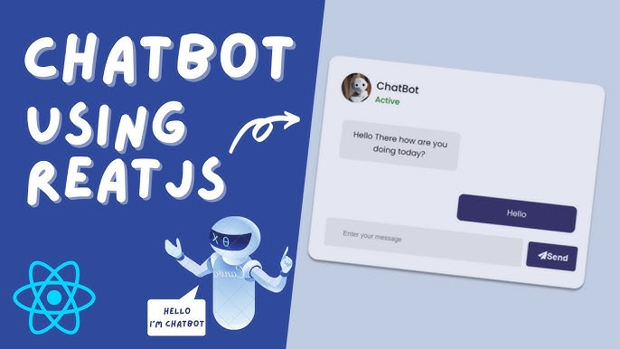

# Chat Bot with GPT 3.5




Welcome to the Chat Bot project using GPT 3.5! This repository contains a server and a client, with the server connecting to the OpenAI API and the client being a React-based chat application.

**Please Note:** The demo link is no longer functioning, as the OpenAI API is now a paid service. You can use this project by cloning the repository and connecting it to your personal API key.

## Technologies Used

- React
- Tailwind CSS

## Project Structure

This repository is organized into two main folders:

1. **Server:** This folder contains the server-side code. The server is responsible for connecting to the OpenAI API and handling API requests.

2. **Client:** This folder contains the client-side code. It's a React-based chat application that allows you to interact with the chat bot.

## Getting Started

To get started with this project, follow these steps:

1. Clone this repository to your local machine.

2. Navigate to the `server` folder and set up your OpenAI API key.

    Create a `.env` file in the `server` folder and add your OpenAI API key like this:

    ```
    OPENAI_API_KEY=your-api-key-here
    ```

3. Install dependencies for the server and client. You can do this by running the following commands in their respective folders:

    For the server:

    ```bash
    cd server
    npm install
    ```

    For the client:

    ```bash
    cd client
    npm install
    ```

4. Start the server and client separately. In the `server` folder, run:

    ```bash
    npm start
    ```

    In the `client` folder, run:

    ```bash
    npm start
    ```

5. Visit `http://localhost:3000` in your browser to use the chat bot application.

## Usage

You can use the chat bot application to send queries and receive answers. The client communicates with the server, which in turn sends requests to the OpenAI API to fetch responses.

Make sure your OpenAI API key is correctly set up in the `server` folder's `.env` file.

## License

This project is licensed under the [MIT License](LICENSE).

---

Happy Chatting with GPT 3.5!
